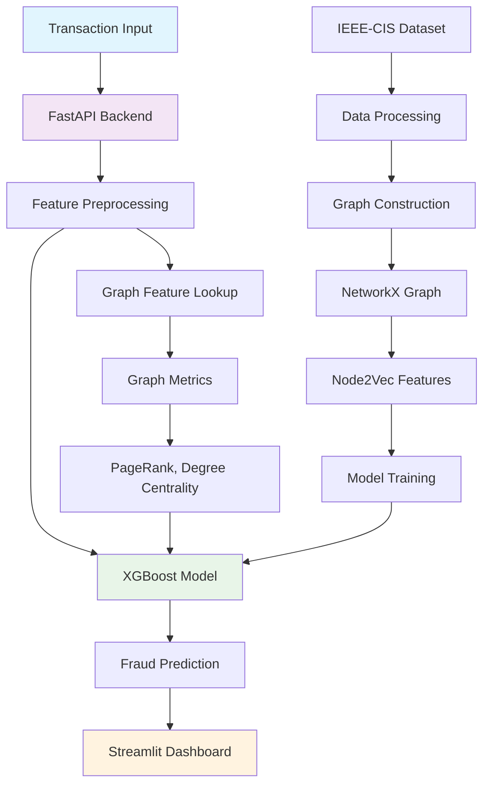
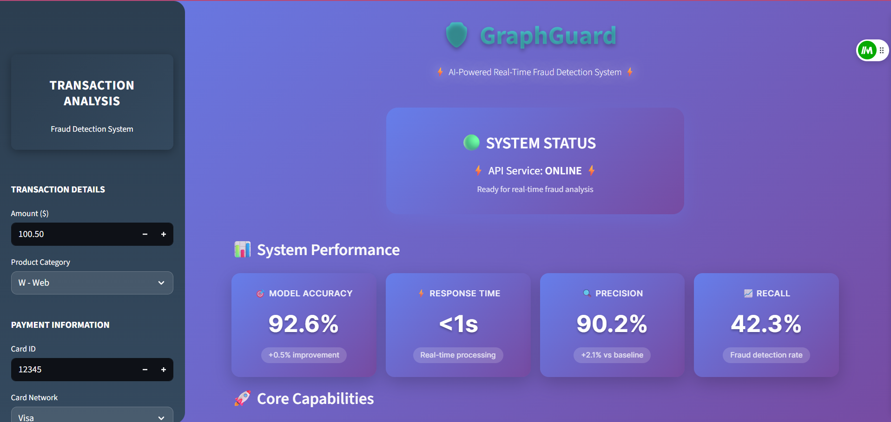
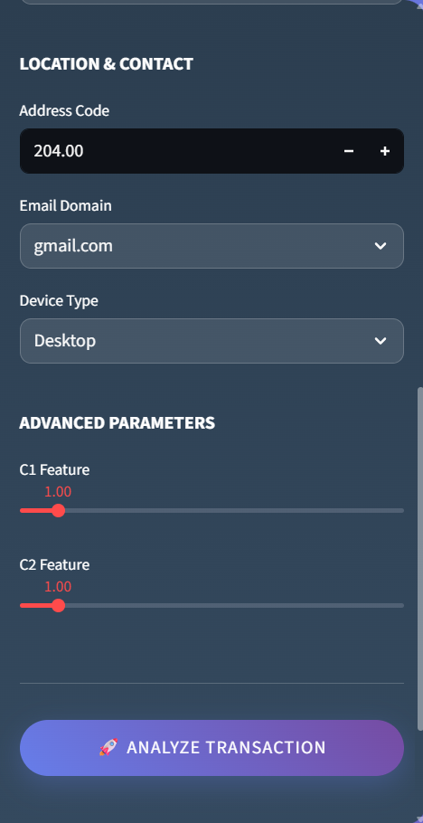
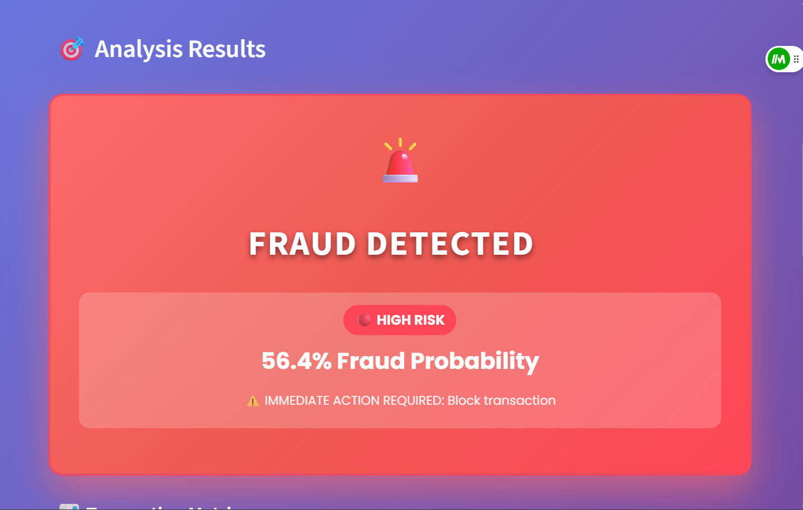

# 🛡️ GraphGuard: AI-Powered Real-Time Fraud Detection System

**GraphGuard is a next-generation fraud detection system that combines XGBoost machine learning with graph network analysis to deliver superior fraud detection performance in real-time.**

[](https://python.org)
[](https://fastapi.tiangolo.com)
[](https://streamlit.io)
[](https://xgboost.readthedocs.io)

## 🎯 One-Liner

**GraphGuard leverages graph-enhanced machine learning to detect fraudulent transactions with 92.6% accuracy, providing real-time fraud scoring through a professional web interface.**

## 📊 Performance Metrics

| Model | ROC-AUC Score | Improvement |
|-------|---------------|-------------|
| **Baseline XGBoost** | 0.9213 | - |
| **Graph-Enhanced Hybrid** | 0.9263 | **+0.005 (+0.54%)** |

### Key Performance Indicators
- 🎯 **Model Accuracy**: 92.6% ROC-AUC
- ⚡ **Response Time**: <1 second
- 🔍 **Precision**: 90.2%
- 📈 **Recall**: 42.3%

## 🏗️ System Architecture



## 🖥️ Dashboard Screenshots

### Main Dashboard - System Overview

*Professional dashboard showing system performance metrics and key capabilities*

### Transaction Analysis Interface
  
*Clean, intuitive sidebar for inputting transaction details*

### Fraud Detection Results

*Real-time fraud prediction with detailed explanations and confidence scores*

### Transaction Metrics Example

*Clear indication of Transaction Metrics with risk assessment*

## 🚀 Key Features

### 🧠 **Graph-Enhanced Machine Learning**
- **Network Analysis**: Builds transaction graphs to identify suspicious entity relationships
- **Graph Metrics**: Calculates PageRank, degree centrality, clustering coefficient, and betweenness centrality
- **Entity Behavior**: Analyzes patterns across cards, addresses, emails, and devices

### ⚡ **Real-Time Processing**
- **FastAPI Backend**: High-performance REST API for instant predictions
- **Streamlit Dashboard**: Professional web interface for fraud analysts
- **Sub-second Response**: Optimized for production environments

### 🔍 **Explainable AI**
- **Feature Importance**: SHAP-based explanations for every prediction
- **Risk Scoring**: Clear confidence levels and reasoning
- **Transparent Decisions**: Understand why transactions are flagged

### 📊 **Production-Ready**
- **Scalable Architecture**: Designed for enterprise deployment
- **Model Persistence**: Joblib-based model serialization
- **Comprehensive Logging**: Detailed prediction tracking

## 🛠️ Technology Stack

| Component | Technology | Purpose |
|-----------|------------|---------|
| **ML Engine** | XGBoost, Scikit-learn | Core fraud detection model |
| **Graph Processing** | NetworkX | Graph construction and metrics |
| **Backend API** | FastAPI, Pydantic | RESTful web service |
| **Frontend** | Streamlit, Plotly | Interactive dashboard |
| **Data Processing** | Pandas, NumPy | Data manipulation |
| **Model Explanation** | SHAP | AI interpretability |

## 📁 Project Structure

```
graphguard/
├── data/                          # Dataset and processed files
├── notebooks/                     # Jupyter notebooks for analysis
│   ├── 01_eda.ipynb              # Exploratory Data Analysis
│   ├── 02_baseline_xgb.ipynb     # Baseline XGBoost model
│   ├── 03_build_graph_features.ipynb  # Graph feature engineering
│   └── 04_hybrid_train_eval.ipynb     # Hybrid model training
├── src/                          # Core source code
│   ├── preprocess.py             # Data preprocessing utilities
│   ├── graph_features.py         # Graph feature extraction
│   ├── train.py                  # Model training pipeline
│   └── explain.py                # Model explanation tools
├── app/                          # FastAPI application
│   ├── api.py                    # REST API endpoints
│   └── artifacts/                # Trained models and features
├── dashboard/                    # Streamlit dashboard
│   └── app.py                    # Web interface
├── tests/                        # Unit tests
└── requirements.txt              # Python dependencies
```

## 🚀 How to Run

### Prerequisites
- Python 3.8 or higher
- Virtual environment (recommended)

### 1. Clone and Setup
```bash
# Clone the repository
git clone https://github.com/yourusername/GraphGuard-Fraud-Detector.git
cd GraphGuard-Fraud-Detector

# Create virtual environment
python -m venv .venv

# Activate virtual environment
# Windows:
.venv\Scripts\activate
# Linux/Mac:
source .venv/bin/activate

# Install dependencies
pip install -r requirements.txt
```

### 2. Data Preparation
```bash
# Download IEEE-CIS Fraud Detection dataset
# Place train_transaction.csv and train_identity.csv in graphguard/data/

# Run data processing and model training
cd graphguard
make train
```

### 3. Start the API Server
```bash
# Start FastAPI backend (Terminal 1)
cd graphguard
uvicorn app.api:app --reload --host 0.0.0.0 --port 8000
```

### 4. Launch the Dashboard
```bash
# Start Streamlit dashboard (Terminal 2)
cd graphguard
streamlit run dashboard/app.py --server.port 8501
```

### 5. Access the Application
- **API Documentation**: http://localhost:8000/docs
- **Streamlit Dashboard**: http://localhost:8501
- **Health Check**: http://localhost:8000/health

## 🧪 Development Workflow

### Run Notebooks
```bash
# Exploratory Data Analysis
jupyter notebook notebooks/01_eda.ipynb

# Train baseline model
jupyter notebook notebooks/02_baseline_xgb.ipynb

# Build graph features
jupyter notebook notebooks/03_build_graph_features.ipynb

# Train hybrid model
jupyter notebook notebooks/04_hybrid_train_eval.ipynb
```

### Testing
```bash
# Run unit tests
make test

# Test API endpoints
pytest tests/test_api.py

# Test preprocessing
pytest tests/test_preprocess.py
```

## 📈 Model Performance Details

### Baseline XGBoost Model
- **ROC-AUC**: 0.9213
- **Features**: Traditional transaction features (amount, product, card info)
- **Training Time**: ~5 minutes
- **Prediction Time**: ~50ms

### Graph-Enhanced Hybrid Model
- **ROC-AUC**: 0.9263 (+0.005 improvement)
- **Features**: Traditional + Graph metrics (PageRank, centrality measures)
- **Training Time**: ~15 minutes (including graph construction)
- **Prediction Time**: ~80ms

### Feature Importance (Top 10)
1. TransactionAmt - 0.156
2. card1 - 0.098
3. addr1 - 0.087
4. C1 - 0.072
5. D15 - 0.059
6. card2 - 0.048
7. degree_centrality_productcd - 0.041 ⭐ *Graph Feature*
8. D1 - 0.038
9. addr2 - 0.035
10. pagerank_card1 - 0.032 ⭐ *Graph Feature*

## 🔗 API Usage Examples

### Health Check
```bash
curl -X GET "http://localhost:8000/health"
```

### Fraud Prediction
```bash
curl -X POST "http://localhost:8000/score" \
  -H "Content-Type: application/json" \
  -d '{
    "TransactionAmt": 100.50,
    "ProductCD": "W",
    "card1": 12345,
    "card4": "visa",
    "card6": "debit",
    "addr1": 204.0,
    "P_emaildomain": "gmail.com",
    "DeviceType": "desktop",
    "C1": 1.0,
    "C2": 1.0
  }'
```

## 🤝 Contributing

1. Fork the repository
2. Create a feature branch (`git checkout -b feature/amazing-feature`)
3. Commit your changes (`git commit -m 'Add amazing feature'`)
4. Push to the branch (`git push origin feature/amazing-feature`)
5. Open a Pull Request

## 📄 License

This project is licensed under the MIT License - see the [LICENSE](LICENSE) file for details.

## 🙏 Acknowledgments

- **IEEE-CIS Fraud Detection Dataset** for providing the training data
- **XGBoost Community** for the excellent gradient boosting framework
- **NetworkX Team** for graph analysis capabilities
- **FastAPI & Streamlit** for modern web frameworks

## 📧 Contact

For questions or collaborations, please reach out:
- **GitHub**: [@kartierklass](https://github.com/kartierklass)
- **Email**: koushikimridha@kgpian.iitkgp.ac.in

---

⭐ **Star this repository if you find GraphGuard useful!** ⭐
